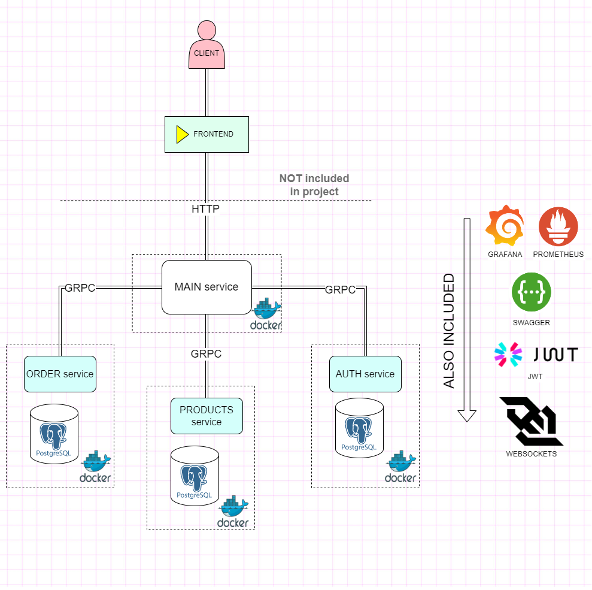
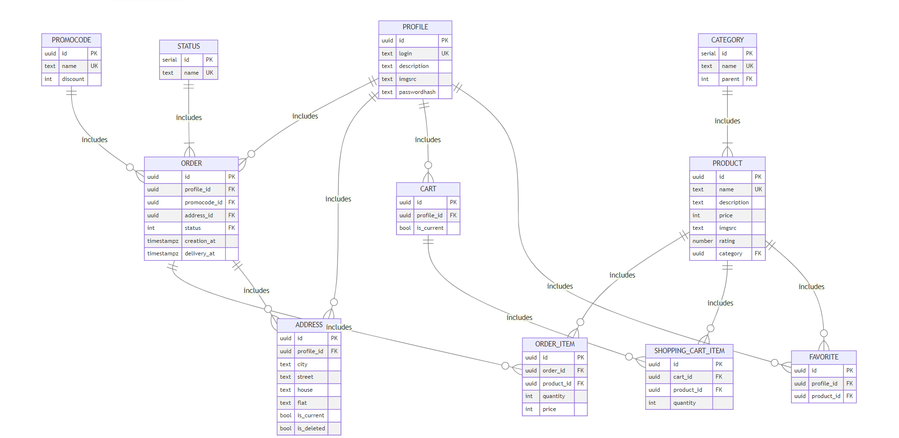
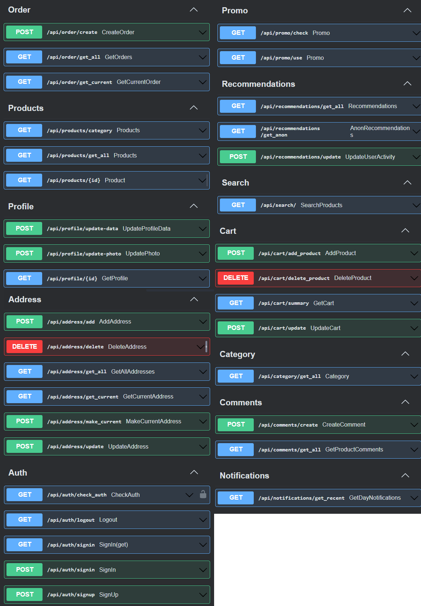

# E-Commerce Microservices with Golang

This is a pet project, which is true example of:
- writing clean and efficient code;
- databases designing and managing(the right way, i believe)(psql;
- how to implement security actions(JWT token);
- data-request validations;
- implementing monitoring tools to track the performance and health of backend systems(Grafana, Prometheus);
- concurrency-safe connection pool for pgx;
## Service Diagram

This is a service diagram. These are services planned to be implemented


### App structure



### ER-Diagramm



### .env file example
```
CONFIG_PATH='./config/config.yaml'
POSTGRES_DB='ozone'
POSTGRES_PASSWORD='1'
DB_PORT='5432'
POSTGRES_USER='postgres'
AUTH_JWT_SECRET_KEY='secret'
CSRF_JWT_SECRET_KEY='secret'
CONFIG_PATH="config/config.yaml"
ENVIROMENT="dev"
LOG_FILE_PATH="shop.log"
PHOTOS_FILE_PATH="photos/"
DB_HOST="0.0.0.0"
GRPC_AUTH_PORT="8011"
GRPC_ORDER_PORT="8012"
GRPC_PRODUCTS_PORT="8013"
GRPC_AUTH_CONTAINER_IP="shop-auth"
GRPC_ORDER_CONTAINER_IP="shop-order"
GRPC_PRODUCTS_CONTAINER_IP="shop-products"
```

### Swagger documentation


### Running (for local)

 Run app without docker (for local). Services are running independently (in different terminals if you dare):

```
make run_auth
make run_order
make run_products
make run_main
```
For this services(grpc mainly) you can run relevant clients:
```
make client_auth
make client_order
make client_products
```


#### or 

You can start it together(services, i mean) by one command:
```
make run_all
```


### Running (for prod)

To start app in dev mode, you need docker only (and setup .env file):
```
docker compose up
```


## Copyright & some notes

Hi there! The main idea, some technique, practices and base approach was kindly borrowed from mail.ru team (golang based course) "Потатики" ,
 thank you so much, guys, you are the best!!!

* [Ruslan Khalikov](https://github.com/fitzplsr);
* [Khristina Kirillova](https://github.com/khristina455);
* [Dmitriy Belozerov](https://github.com/scremyda);
* [Gleb Pankin](https://github.com/MrDjeb).


But i also would be great greatfull for your modest feedback)))